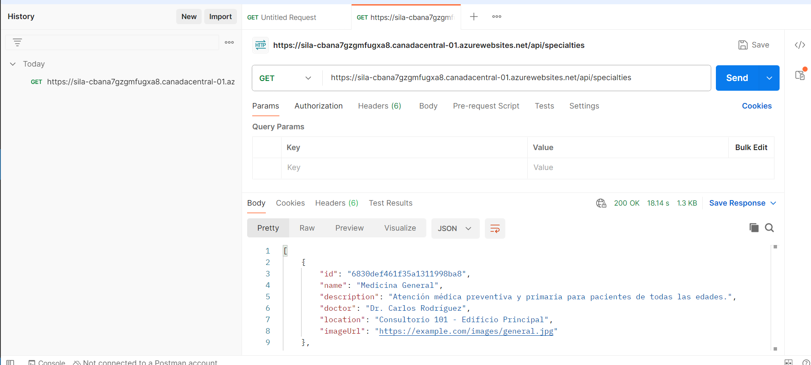
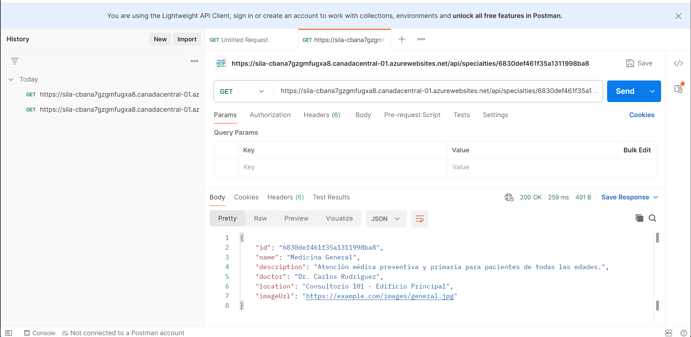
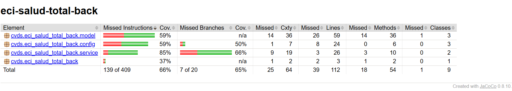

# ECI Salud Vital - Sistema de Gestión de Citas Médicas

Este repositorio contiene el backend del proyecto ECI Salud Vital, un sistema para la gestión de citas médicas y especialidades médicas.

## Arquitectura

### Arquitectura Backend

El backend está implementado como una aplicación Spring Boot con MongoDB como base de datos, siguiendo una arquitectura por capas:

- **Capa de Controladores**: Maneja las peticiones HTTP y delega a los servicios
- **Capa de Servicios**: Implementa la lógica de negocio para citas y especialidades
- **Capa de Repositorios**: Interactúa con la base de datos MongoDB
- **Capa de Modelos**: Define las entidades del dominio (Appointment, Specialty)

### Diagrama de Componentes

```
+-------------------+      +-------------------+      +-------------------+
|                   |      |                   |      |                   |
|   Controllers     |----->|    Services       |----->|   Repositories    |
|  (ClinicController|      |(AppointmentService|      |(AppointmentRepo  |
|                   |      | SpecialtyService) |      | SpecialtyRepo)    |
+-------------------+      +-------------------+      +----------+--------+
                                                                 |
                                                                 v
                                                      +-------------------+
                                                      |                   |
                                                      |     MongoDB       |
                                                      |    Database       |
                                                      |                   |
                                                      +-------------------+
```

## Tecnologías Implementadas

### Backend
- Java 17
- Spring Boot 3.1.5
- MongoDB
- JaCoCo para cobertura de código
- Maven para gestión de dependencias
- OpenAPI/Swagger para documentación de API
- Pruebas unitarias con JUnit y Mockito

## Cómo Ejecutar el Proyecto

### Backend
1. Clonar este repositorio
2. Asegurar tener instalados Java 17 y Maven
3. Navegar al directorio raíz
4. Ejecutar `mvn spring-boot:run`
5. La API estará disponible en http://localhost:8080
6. La documentación Swagger estará disponible en http://localhost:8080/swagger-ui.html

## Endpoints de API Implementados

El backend actualmente proporciona los siguientes endpoints:

### Especialidades
- `GET /api/specialties` - Obtiene todas las especialidades médicas

- `GET /api/specialties/{id}` - Obtiene una especialidad específica por ID

### Citas
- `POST /api/appointments` - Crea una nueva cita médica
- `GET /api/appointments/email/{email}` - Obtiene todas las citas de un usuario por email
- `GET /api/appointments/email/{email}/status/{status}` - Obtiene citas filtradas por email y estado
- `PUT /api/appointments/{id}/cancel` - Cancela una cita existente

## Cobertura de Código

El proyecto mantiene una cobertura de pruebas utilizando JaCoCo. Las pruebas cubren:
- Modelos (Appointment, Specialty)
- Servicios (AppointmentService, SpecialtyService)
- Controladores (ClinicController)

## Funcionalidades Implementadas

### Gestión de Especialidades
El sistema permite consultar las especialidades médicas disponibles incluyendo información del médico, ubicación y descripción.

### Agendamiento de Citas
Los pacientes pueden agendar citas médicas seleccionando especialidad, fecha y proporcionando sus datos personales.

### Consulta de Citas
Los usuarios pueden consultar sus citas registradas usando su correo electrónico, con opciones para filtrar por estado (confirmada, rechazada, cancelada).

### Cancelación de Citas
El sistema permite a los usuarios cancelar citas previamente agendadas.

### Inicialización de Datos
El sistema se inicializa con datos de especialidades médicas de ejemplo.

## Configuración

El proyecto está configurado para conectarse a una base de datos MongoDB en la nube (MongoDB Atlas). La configuración se encuentra en el archivo 

application.properties

.

## Despliegue

El backend está desplegado en Azure y accesible en:
https://sila-cbana7gzgmfugxa8.canadacentral-01.azurewebsites.net/

## Frontend Repository

El código fuente del frontend de ECI Salud Vital está disponible en un repositorio separado:
ECI-Salud-Total-Front

Para obtener información sobre la implementación y ejecución del frontend, por favor consulte el repositorio correspondiente.

## Pruebas

El proyecto incluye pruebas unitarias para todos los componentes principales. Para ejecutar las pruebas:

```sh
mvn test
```

COBERTURA DEL 66%
